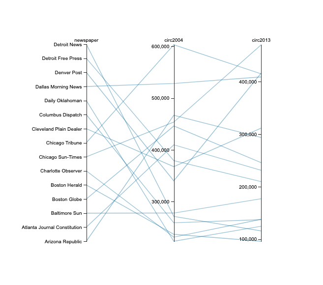
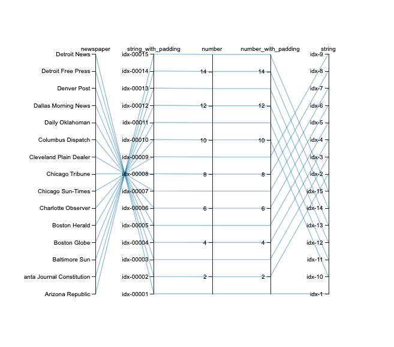
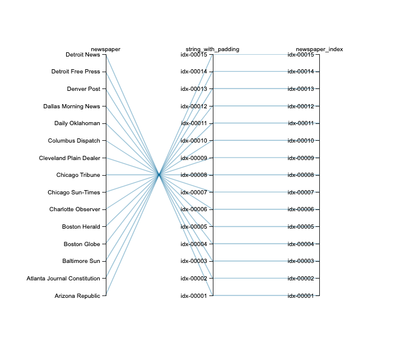
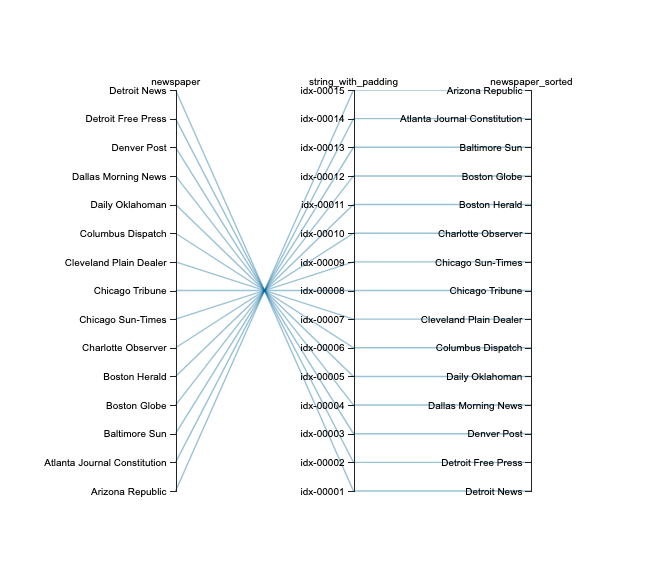
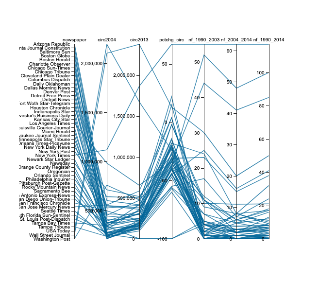
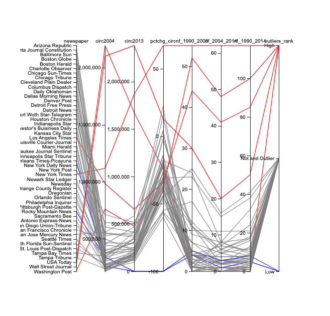

Community Project  
Sorting Text Data with parcoords()
================
ad4277

``` r
# Importing Libraries
library(tidyverse)
library(parcoords)
library(knitr)
```

## Preparing data

**Loading the data**  

``` r
library(fivethirtyeight)
pulitzer_data <- pulitzer
```

  
  
**Creating Sample with 15 rows**  

``` r
pulitzer_data_15 <-
  pulitzer_data |>
  arrange(newspaper) |>
  head(15)
```

  
  
**Parallel coordinates plot**  
The column `newspaper` is sorted in descending alphabetical order by
default.

``` r
parcoords(pulitzer_data_15[, c("newspaper","circ2004","circ2013")]
          , rownames = FALSE
          , alpha = 0.4)
```



  
  

## Index Column

**Creating an Index Column for `newspaper`**  
We want to create an index column that will have the highest value of
the index assigned to the first value of the column `newspaper` that we
want to see at the top of the axis, and the lowest value of the index
should be assign to the value we want to see at the bottom.

``` r
pulitzer_data_15 |> 
  select(newspaper) |>
  arrange(desc(newspaper)) |>
  mutate(number = row_number()) |> 
  arrange(newspaper) |> 
  kable(align = "l")
```

| newspaper                    | number |
|:-----------------------------|:-------|
| Arizona Republic             | 15     |
| Atlanta Journal Constitution | 14     |
| Baltimore Sun                | 13     |
| Boston Globe                 | 12     |
| Boston Herald                | 11     |
| Charlotte Observer           | 10     |
| Chicago Sun-Times            | 9      |
| Chicago Tribune              | 8      |
| Cleveland Plain Dealer       | 7      |
| Columbus Dispatch            | 6      |
| Daily Oklahoman              | 5      |
| Dallas Morning News          | 4      |
| Denver Post                  | 3      |
| Detroit Free Press           | 2      |
| Detroit News                 | 1      |

  
  

**Testing different methods to create an Index**  

``` r
pulitzer_data_index <-
  pulitzer_data_15 |> 
  select(newspaper) |>
  arrange(desc(newspaper)) |>
  mutate(number              = row_number()) |> 
  mutate(number_with_padding = sprintf("%05d", row_number())) |> 
  mutate(string              = paste0("idx-", row_number())) |> 
  mutate(string_with_padding = paste0("idx-",sprintf("%05d", row_number()))) |> 
  arrange(newspaper)
```

| newspaper                    | number | number_with_padding | string | string_with_padding |
|:-----------------------------|:-------|:--------------------|:-------|:--------------------|
| Arizona Republic             | 15     | 00015               | idx-15 | idx-00015           |
| Atlanta Journal Constitution | 14     | 00014               | idx-14 | idx-00014           |
| Baltimore Sun                | 13     | 00013               | idx-13 | idx-00013           |
| Boston Globe                 | 12     | 00012               | idx-12 | idx-00012           |
| Boston Herald                | 11     | 00011               | idx-11 | idx-00011           |
| Charlotte Observer           | 10     | 00010               | idx-10 | idx-00010           |
| Chicago Sun-Times            | 9      | 00009               | idx-9  | idx-00009           |
| Chicago Tribune              | 8      | 00008               | idx-8  | idx-00008           |
| Cleveland Plain Dealer       | 7      | 00007               | idx-7  | idx-00007           |
| Columbus Dispatch            | 6      | 00006               | idx-6  | idx-00006           |
| Daily Oklahoman              | 5      | 00005               | idx-5  | idx-00005           |
| Dallas Morning News          | 4      | 00004               | idx-4  | idx-00004           |
| Denver Post                  | 3      | 00003               | idx-3  | idx-00003           |
| Detroit Free Press           | 2      | 00002               | idx-2  | idx-00002           |
| Detroit News                 | 1      | 00001               | idx-1  | idx-00001           |

  
  

**Plotting all Indexes:**  
The `string_with_padding` should be the preferred method because it has
the right order and shows all the values in the axis.  
The `number` and `number_with_padding` methods have the right order in
the axis, but not all values are displayed (such as 13, 11, 9)  
The `string` method should not be used because it doesn’t really
understand the sequence of the numbers. As we can observe, the values
starting with idx-1\* gets grouped together (1,10,11,12), before it goes
to 2,3,4 and so on.

``` r
parcoords(pulitzer_data_index[, c("newspaper", 
                                  "string_with_padding", 
                                  "number", 
                                  "number_with_padding", 
                                  "string")]
          , rownames = FALSE
          , brushMode = "1D-axes"
          , alpha = 0.4
          , alphaOnBrushed = 0.2)
```



  
  

**Comparing Original column vs Index column**  

``` r
pulitzer_data_index_renamed <-
  pulitzer_data |> 
  select(newspaper) |>
  arrange(newspaper) |>  head(15) |>
  arrange(desc(newspaper)) |>
  mutate(string_with_padding  = paste0("idx-",sprintf("%05d", row_number()))) |> 
  mutate(newspaper_index      = paste0("idx-",sprintf("%05d", row_number())))
```

``` r
parcoords(pulitzer_data_index_renamed, 
          , rownames = FALSE
          , brushMode = "1D-axes"
          , alpha = 0.4
          , alphaOnBrushed = 0.2)
```



  
  
**Vector of names for Axis Tick Values**  

``` r
# Method 1:
sorted_newspapers_names <- sort(unique(pulitzer_data_index$newspaper))

# Method 2:
sorted_newspapers_names <- 
  pulitzer_data_index |> 
  distinct(newspaper) |> 
  arrange(newspaper) |> 
  pull(newspaper)
```

    ##  [1] "Arizona Republic"             "Atlanta Journal Constitution"
    ##  [3] "Baltimore Sun"                "Boston Globe"                
    ##  [5] "Boston Herald"                "Charlotte Observer"          
    ##  [7] "Chicago Sun-Times"            "Chicago Tribune"             
    ##  [9] "Cleveland Plain Dealer"       "Columbus Dispatch"           
    ## [11] "Daily Oklahoman"              "Dallas Morning News"         
    ## [13] "Denver Post"                  "Detroit Free Press"          
    ## [15] "Detroit News"

  
  

**Overwrite `axis title` and `tick values` inside axis**  
Using the new index column, we will use the parameter `dimensions` to
overwrite the title of the axis and tick values with the newspaper
values.

``` r
parcoords(pulitzer_data_index_renamed[, c(
                            "newspaper",
                            "string_with_padding",
                            "newspaper_index"
                            )], 
          , rownames = FALSE
          , brushMode = "1D-axes"
          , alpha = 0.4 
          , alphaOnBrushed = 0.2
          , dimensions = list(
                  newspaper_index = list(
                        title = "newspaper_sorted",
                        tickValues = sorted_newspapers_names))
          )
```



  
  
  
  
  
  

## Example with Full Dataset:

``` r
pulitzer_data_all <-
  pulitzer_data |> 
  arrange(desc(newspaper)) |>
  mutate(newspaper_index = paste0("idx-",sprintf("%05d", row_number()))) 

parcoords(pulitzer_data_all[, c(
                            "newspaper_index",
                            "circ2004", 
                            "circ2013", 
                            "pctchg_circ",
                            "nf_1990_2003",
                            "nf_2004_2014",
                            "nf_1990_2014"
                            )], 
          , rownames = FALSE
          , brushMode = "1D-axes"
          , reorderable = T
          , alpha = 0.8
          , alphaOnBrushed = 0.2
          , dimensions = list(
                newspaper_index = list(
                      title = "newspaper",
                      tickValues = sort(unique(pulitzer_data_all$newspaper))))
          )
```



  
  
  
  
  
  

## Bonus Method: Custom Sort

**Adding custom sort to Outliers**  
This an example with 2 text columns.  
The columns `newspaper` is sorter in ascending alphabetical order, and
the column `outliers_rank` is sorted using a custom order.



  
  
  
  
  
  
  

**How to create the chart above:**  

<div class="panel-tabset">

## Outliers Example

**Preparing data:**  

``` r
pulitzer_data_outliers <-
  pulitzer_data |> 
  arrange(desc(newspaper)) |> 
  mutate(newspaper_index = paste0("000-",sprintf("%05d", row_number()))) |> 
  mutate(outliers_rank_index = ifelse(newspaper %in% c('USA Today',
                                                 'New York Times',
                                                 'Wall Street Journal',
                                                 'Los Angeles Times',
                                                 'Washington Post'),'03-High',
                                ifelse(newspaper %in% c(
                                  'Rocky Mountain News',
                                  'New Orleans Times-Picayune'),'01-Low',
                                  '02-Not an Outlier') ))
```

  
  
**Chart:**  

``` r
parcoords(
  pulitzer_data_outliers[, c("newspaper_index", 
                             "circ2004", 
                             "circ2013", 
                             "pctchg_circ", 
                             "nf_1990_2003", 
                             "nf_2004_2014",
                             "nf_1990_2014",
                             "outliers_rank_index")], 
  rownames = FALSE,
  brushMode = "1D-axes",
  reorderable = TRUE,
  alpha = 0.8,
  alphaOnBrushed = 0.2,
  dimensions = list(
        newspaper_index = list(
              title = "newspaper",
              tickValues = sort(unique(pulitzer_data_outliers$newspaper))),
        outliers_rank_index = list(
              title = "outliers_rank",
              tickValues = c("High","Not an Outlier","Low"))
        ),
  color = list(
        colorBy = "outliers_rank_index",  
        colorScale = "scaleOrdinal",
        colorScheme = c("red", "gray","blue")),
  withD3 = TRUE
  )
```


</div>
